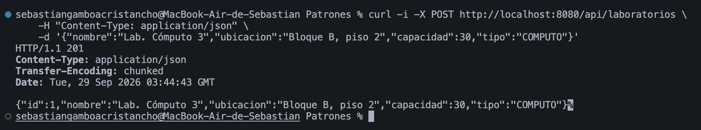
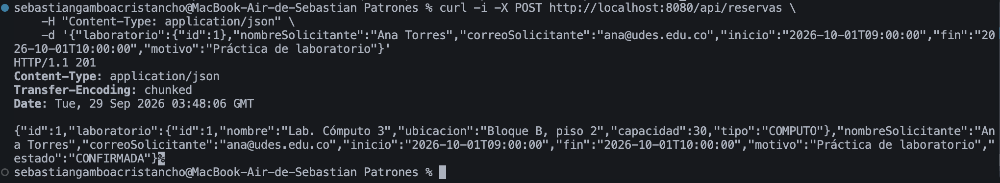
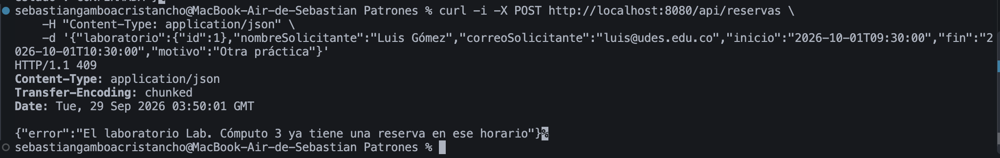
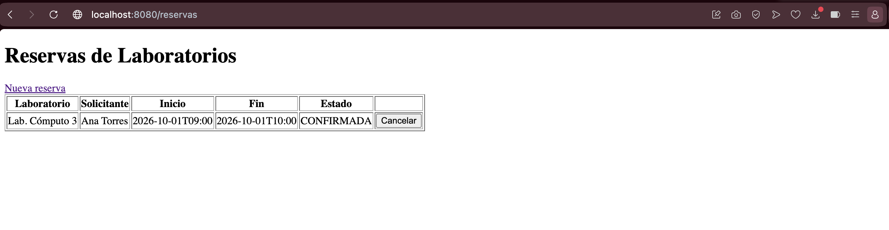
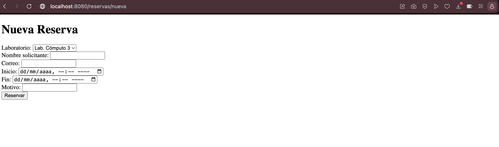
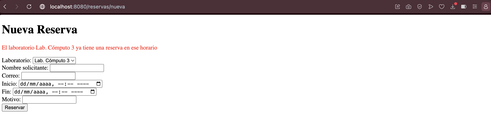

# Post-contenido — Unidad 5: Integración en Aplicaciones Web

## Descripción

Repositorio del post-contenido de la Unidad 5 de Patrones de Diseño de Software.
Un único proyecto Spring Boot (`reservas-labs-api`) para la reserva de
laboratorios de cómputo, con dos partes: una API REST en capas (Entity,
Repository, Service, Controller) sobre H2, y una vista Thymeleaf (MVC clásico)
que reutiliza el mismo Service.

## Parte 1 — Repository, Service y Controller REST

`LaboratorioRepository` y `ReservaRepository` extienden `JpaRepository`;
`ReservaRepository` agrega una consulta JPQL propia (`buscarSolapamientos`) para
detectar solapamientos de horario. `ReservaService` concentra las reglas de
negocio (solapamiento, horario de atención, duración, cancelación tardía).
`ReservaController` y `LaboratorioController` exponen `/api/reservas` y
`/api/laboratorios`. Ver paquetes `model/`, `repository/`, `service/`,
`exception/` y `controller/`.

## Parte 2 — Vista MVC con Thymeleaf

`ReservaWebController` expone `/reservas` con Thymeleaf, inyectando la **misma**
instancia de `ReservaService` que usa la API REST — sin Service duplicado.
`ReservaWebExceptionHandler` maneja las mismas excepciones de dominio que
`GlobalRestExceptionHandler`, con presentación distinta (redirección con mensaje
en vez de JSON). Ver paquete `web/` y `templates/reservas/`.

## Cómo ejecutar

```bash
mvn clean package
mvn spring-boot:run
```

- **API REST:** `http://localhost:8080/api/reservas`, `http://localhost:8080/api/laboratorios`
- **Vista MVC:** `http://localhost:8080/reservas`, `http://localhost:8080/reservas/nueva`
- **Consola H2:** `http://localhost:8080/h2-console` — JDBC URL `jdbc:h2:mem:reservas_labs_db`, usuario `sa`, sin contraseña

> La base de datos es H2 en memoria: cada reinicio de la aplicación la vacía por
> completo. Para reproducir las pruebas descritas más abajo hay que volver a
> crear el laboratorio con el `POST /api/laboratorios` del primer ejemplo.

## Decisiones de diseño

### Punto de decisión 1 — Ubicación de la validación de solapamiento de horarios

**Pregunta:** ¿la validación de que un laboratorio no tenga dos reservas
solapadas debe resolverse trayendo todas las reservas a memoria y comparando en
Java dentro del Service, o apoyándose en una consulta del Repository que filtra
directamente en la base de datos?

**Decisión tomada:** se optó por una consulta JPQL en `ReservaRepository`
(`buscarSolapamientos`) que filtra en el motor de base de datos por
`laboratorio.id`, excluye las reservas `CANCELADA` y compara los rangos de fecha
(`inicio < :fin AND fin > :inicio`). Esta consulta responde una pregunta de
**datos** ("¿qué reservas existentes se solapan con este rango?"), mientras que
`ReservaService.crear()` es quien toma la **decisión de negocio** sobre ese
resultado: si la lista de solapamientos no está vacía, lanza
`ReservaConflictException` con un mensaje específico.

**Por qué no se hizo al revés (filtrar en memoria):** traer todas las reservas de
un laboratorio a memoria con `findByLaboratorioId()` y comparar rangos en un
`stream()` de Java funcionaría hoy, con pocos datos de prueba, pero no escala: el
volumen de reservas de un laboratorio crece indefinidamente con el tiempo, y cada
intento de creación de reserva tendría que cargar y recorrer un conjunto de datos
cada vez más grande. Filtrar en SQL delega ese trabajo al motor de base de datos.

**Qué se perdería si el Controller llamara directamente a
`buscarSolapamientos()` sin pasar por el Service:** perdería por completo la
traducción a `ReservaConflictException` — tendría que reimplementar el
`if (!solapamientos.isEmpty()) throw ...` en cada lugar donde se necesite crear
una reserva. Como `ReservaService` también aplica la regla de horario de
atención y de duración antes de llegar a esa consulta, saltarse el Service
significaría duplicar tres reglas en cada controlador nuevo que necesite crear
una reserva. Esto se confirma en la Parte 2: `ReservaWebController` reutiliza el
mismo `ReservaService.crear()` en lugar de reimplementar esta lógica (ver Punto
de decisión 3).

### Punto de decisión 2 — Reglas con y sin apoyo del Repository

**Criterio aplicado:** no toda regla de negocio necesita datos de la base. Dentro
de `ReservaService` se distinguen dos tipos de reglas:

- **Reglas que dependen de otras filas de datos** (necesitan el Repository): el
  solapamiento de horarios (Punto de decisión 1), porque su respuesta depende de
  qué otras reservas existen actualmente para ese laboratorio.
- **Reglas que solo dependen de los propios campos del objeto que se está
  validando** (no necesitan el Repository ni la base de datos): el horario de
  atención (`07:00`–`21:00`) y la duración permitida (`30 minutos` a `3 horas`),
  implementadas en `validarHorarioYDuracion()`, que opera únicamente sobre
  `inicio` y `fin` de la `Reserva` recibida, sin consultar ninguna otra fila.

**Regla general documentada:** si una validación necesita comparar el dato de
entrada contra información que solo la base de datos conoce, corresponde una
consulta del Repository. Si la validación solo depende del propio objeto que se
está evaluando, no hay razón para involucrar al Repository ni a la base de
datos — hacerlo añadiría una consulta innecesaria y acoplaría una regla
puramente de dominio a la capa de persistencia sin ningún beneficio.

Al probar el sistema con `curl` se observó, sin embargo, que ambos tipos de
regla terminan comunicándose al cliente REST de la misma forma
(`ReservaConflictException` → HTTP 409), lo cual permitió detectar que el
checkpoint del Paso 9 de esta actividad describe que una reserva fuera del
horario de atención debería responder `400 Bad Request`, mientras que el código
tal como está especificado usa `ReservaConflictException` para esa regla, que
`GlobalRestExceptionHandler` mapea a **409 Conflict**, no a 400. El único caso
que efectivamente produce 400 en este sistema es el rechazo de `@Valid`
(`MethodArgumentNotValidException`), como un `nombreSolicitante` vacío o un
`correoSolicitante` con formato inválido. Ambos comportamientos se comprobaron
con `curl` (reserva fuera de horario → 409 con el mensaje del horario de
atención; campos inválidos → 400 con la lista de errores de validación), y se
documentan aquí con el código de estado realmente observado en cada caso, en
lugar de asumir el que indicaba el checkpoint sin verificarlo.

### Punto de decisión 3 — Cómo comparten Service el Controller MVC y el REST

**Pregunta:** ¿cómo comparten `ReservaWebController` (MVC) y `ReservaController`
(REST, Parte 1) la lógica de negocio sin duplicarla?

**Decisión implementada:** la más directa posible — ambos reciben por
constructor la **misma clase** `ReservaService`, que Spring gestiona como un
único bean *singleton*. Ninguno de los dos controladores reimplementa la
validación de solapamiento ni la de horario:

```java
// ReservaController (REST, Parte 1)
public ReservaController(ReservaService service) { this.service = service; }

// ReservaWebController (MVC, Parte 2)
public ReservaWebController(ReservaService service, LaboratorioRepository laboratorioRepo) {
    this.service = service;
    this.laboratorioRepo = laboratorioRepo;
}
```

**Alternativa descartada:** copiar la lógica de validación dentro de
`ReservaWebController`, o crear un segundo `ReservaWebService` casi idéntico a
`ReservaService`. Esto habría hecho que corregir la regla de solapamiento en el
futuro requiriera cambiarla en dos lugares — exactamente el problema que la capa
Service existe para evitar. Se comprobó en la práctica: al enviar una reserva
fuera de horario tanto por `curl` (API REST) como por el formulario web (MVC),
ambas superficies lanzaron el mismo mensaje de `ReservaConflictException` ("La
reserva debe estar dentro del horario de atención (07:00 - 21:00)"), confirmando
que ambos controladores ejecutan exactamente la misma lógica sin duplicarla.

### Punto de decisión 4 — Manejo de errores consistente entre MVC y REST

**El vocabulario de errores es exactamente el mismo en ambas superficies:**
tanto `ReservaController` (REST) como `ReservaWebController` (MVC) desencadenan
las mismas dos excepciones de dominio —`ReservaConflictException` y
`RecursoNoEncontradoException`— porque ambos llaman al mismo `ReservaService`.
Lo que cambia no es el **qué** (la regla de negocio y su mensaje), sino el
**cómo se presenta**:

- La API REST responde JSON con un código de estado HTTP
  (`GlobalRestExceptionHandler`, restringido con `annotations = RestController.class`): 409 o 404.
- La vista MVC redirige a una página HTML mostrando el mensaje al usuario
  (`ReservaWebExceptionHandler`, restringido con `assignableTypes = ReservaWebController.class`):
  sin códigos de estado visibles, con una redirección amigable.

**Por qué dos manejadores en vez de uno global:** un único `@RestControllerAdvice`
serializa siempre a JSON, y una página Thymeleaf necesita una redirección con un
mensaje legible en HTML, no un cuerpo JSON. La alternativa de un único manejador
que "detecte" si la petición vino del navegador o de un cliente REST (por
ejemplo, inspeccionando el header `Accept`) es posible, pero añade una rama
condicional por cada excepción. Dos manejadores —cada uno restringido a su tipo
de controlador con `annotations` o `assignableTypes`— mantienen la misma
separación de responsabilidades que el resto del proyecto: una clase por
superficie de presentación, ambas alimentadas por el mismo vocabulario de
excepciones de dominio.

Al probar ambos manejadores se detectó, sin embargo, que
`ReservaWebExceptionHandler.conflicto()` redirige **siempre** a
`/reservas/nueva` cuando captura un `ReservaConflictException`, sin distinguir
si la excepción se originó en `ReservaService.crear()` o en
`ReservaService.cancelar()`. Esto es correcto para los conflictos originados en
`crear()` (el usuario está parado en el formulario `/reservas/nueva` cuando
ocurre el error, así que quedarse ahí tiene sentido), pero resulta en una
experiencia de usuario inconsistente para los conflictos originados en
`cancelar()` —por ejemplo, al intentar cancelar una reserva cuyo horario de
inicio ya pasó, otra regla que también lanza `ReservaConflictException`—: el
usuario está en `/reservas` cuando hace clic en "Cancelar", pero el error lo
redirige a un formulario en blanco en `/reservas/nueva` en vez de devolverlo a
la lista `/reservas` con el mensaje. Esto se comprobó en la práctica intentando
cancelar una reserva con `inicio` en el pasado, y se documenta aquí como una
observación de diseño encontrada durante las pruebas, sin modificar el código
fuente dado por el enunciado.

## Herramientas utilizadas

- Java 17, Spring Boot 3.2, Spring Data JPA, H2, Thymeleaf
- Apache Maven, Postman/curl, Git, GitHub

## Evidencia de funcionamiento

### API REST

**Creación de laboratorio (201 Created):**


**Creación de reserva válida (201 Created):**


**Reserva con horario solapado (409 Conflict):**


### Vista MVC (Thymeleaf)

**Listado de reservas (`/reservas`):**


**Formulario de nueva reserva (`/reservas/nueva`):**


**Mismo conflicto de solapamiento, mostrado en la vista web (comparar con la
captura de la API REST arriba — mismo mensaje de negocio, presentación
distinta, como se explica en el Punto de decisión 4):**


## Conclusiones

Trabajar sobre un mismo `ReservaService` desde dos superficies de presentación
distintas (REST y MVC) dejó clara la diferencia entre una regla de negocio y su
forma de comunicarla: las cuatro reglas implementadas (solapamiento, horario de
atención, duración y cancelación tardía) nunca cambiaron de un lado a otro,
solo cambió cómo se le informaban al usuario — JSON con código de estado en un
caso, una redirección con mensaje en el otro. Decidir dónde ubicar cada regla
resultó más sencillo con un criterio único aplicado de forma consistente: si la
regla necesita datos que solo la base de datos conoce, va apoyada en el
Repository; si depende solo del objeto que se está validando, se queda en Java
puro dentro del Service. Lo más revelador del laboratorio no fue escribir el
código dado, sino verificarlo con pruebas reales sobre la aplicación en
ejecución: eso permitió encontrar dos inconsistencias genuinas entre el
enunciado y el comportamiento real del código —el checkpoint que esperaba 400
donde el sistema produce 409, y el manejador de errores de la Parte 2 que
siempre redirige al formulario de creación aunque el conflicto se origine al
cancelar una reserva— que no se habrían detectado solo leyendo la guía sin
ejecutar la aplicación paso a paso.